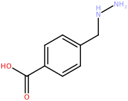
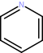
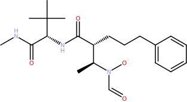

Installing the CDPL Python Bindings
===================================

To be able to follow this tutorial the *CDPL Python* bindings have to be installed on your computer. The most straightforward way to accomplish this task is to install the latest official release deposited on `PyPI`_ using the :program:`pip` command as follows:

.. code:: ipython3

    pip install cdpkit

Other ways to install the Python bindings are described in section `Installation`_.

CDPL Package Overview
=====================

The *CDPL* comprises several sub-packages each providing functionality related to a certain aspect of chem- and pharmacoinformatics. The following table lists all available sub-packages 
together with a brief description of the kind of functionality they provide:

.. list-table::
   :widths: 15 30
   :header-rows: 1

   * - Package
     - Contents
   * - `CDPL.Base`_
     - Core classes defining a software framework for functionality implemented in the other *CDPL* packages
   * - `CDPL.Util`_
     - Implementations of useful general purpose algorithms, containers, function objects and free functions
   * - `CDPL.Math`_
     - Data structures, algorithms and functions related to mathematics
   * - `CDPL.Chem`_
     - Infrastructure for the in-memory representation, I/O and basic processing of molecular
       structures and reactions
   * - `CDPL.MolProp`_
     - Functionality for the calculation/prediction of physicochemical and topological atom, bond and molecule properties
   * - `CDPL.Biomol`_
     - Functionality for the I/O and processing of biological macromolecules
   * - `CDPL.Descr`_
     - Functionality for the generation and processing of pharmacophore and molecule descriptors
   * - `CDPL.Pharm`_
     - Infrastructure for pharmacophore representation, I/O, perception, processing, alignment
       and screening
   * - `CDPL.Shape`_
     - Infrastructure for Gaussian volume-based molecular shape representation, processing, alignment
       and screening
   * - `CDPL.ForceField`_
     - Implementation of MMFF94(s) for molecule conformer energy calculation and 3D structure optimization
   * - `CDPL.ConfGen`_
     - Functionality for molecule 3D structure and conformer ensemble generation
   * - `CDPL.Grid`_
     - Infrastructure for grid data storage, I/O and processing
   * - `CDPL.GRAIL`_
     - Functionality for the generation of GRAIL data sets :cite:`doi:10.1021/acs.jctc.8b00495` and GRADE
       descriptors :cite:`doi:10.1021/acs.jcim.4c01902`
   * - `CDPL.Vis`_
     - Functionality for molecule, reaction and 3D pharmacophore visualization

Basic Concepts
==============

Dynamic Properties
------------------

The *CDPL* stores properties associated with certain types of data like molecules, atoms, bonds, pharmacophores, etc. not as ordinary data members of the implementing classes
but as *key:value* pairs in a dictionary (similar to the `__dict__`_ attribute of Python objects). This design decision was made due to several advantages of this approach:

* Flexibility and extensibility: new properties can be defined at runtime by user code
* Class instance specific property values can be stored directly in the dictionary of the instance they are
  associated with, no external accompanying data structures are required for storing user-defined properties
  unknown to the *CDPL*
* It can be easily determined whether the value of a particular property is available or not by checking if
  the dictionary contains a corresponding entry. C++ class data members (note that *CDPL* Python objects just wrap
  corresponding C++ class instances!) exist in memory after a class instance has been constructed and from that
  point on have a value. This is particularly problematic for properties that cannot be assigned a reasonable
  default value.

All *CDPL* classes supporting this kind of dynamic property storage are derived from class 
`CDPL.Base.PropertyContainer`_ which provides methods for property value lookup, storage, removal, iteration, existence testing and counting. Properties are identified by unique keys of type `CDPL.Base.LookupKey`_ 
that are created on-the-fly during the *CDPL* initialization phase. Keys of pre-defined *CDPL* properties are exported as static attributes of classes that follow the naming scheme *CDPL.<PN>.<CN>Property*. 
*<PN>* denotes the *CDPL* sub-package name (see table above) and *<CN>* is the name of a child class of `CDPL.Base.PropertyContainer`_ for which these properties have been defined (example: atom property keys 
accessible via class `CDPL.Chem.AtomProperty`_). Property values virtually can be of any type and get stored in 
the dictionary as instances of the data wrapper class `CDPL.Base.Any`_. 

Since `CDPL.Base.PropertyContainer`_ methods acting upon a particular property always demand the key of the property as argument and setter/getter methods in addition require knowledge of the value type, corresponding code
is not only tedious to write but also hard to read and error prone. Therefore, each *CDPL* sub-package that introduces properties also provides four free functions (at package level) per property that encapsulate the 
low-level `CDPL.Base.PropertyContainer`_ method calls. These functions internally not only specify the correct property key and value type but also constrain the type of the `CDPL.Base.PropertyContainer`_  
subclass the property has been introduced for. `CDPL.Chem.getOrder()`_, `CDPL.Chem.setOrder()`_, `CDPL.Chem.hasOrder()`_ and `CDPL.Chem.clearOrder()`_ represent an example of such four functions that are provided
for the property `CDPL.Chem.BondProperty.ORDER`_ of `CDPL.Chem.Bond`_ instances using integer as value type.
Using property getter functions (like `CDPL.Chem.getOrder()`_) has the additional benefit that they will, if one 
has been defined, automatically return a default value for unset properties. Defined property default values are exported and accessible as static attributes of classes that follow the naming scheme 
*CDPL.<PN>.<CN>PropertyDefault* (example: `CDPL.Chem.BondPropertyDefault`_; for the meaning of *<PN>* and *<CN>* 
see text above). 

Control-Parameters
------------------

Control-parameters are used for the runtime configuration of arbitrary functionality in a generic, flexible and functionality independent way (in the *CDPL* mainly used by the data I/O and visualization code).
The implementation and usage of the control-parameter infrastructure largely parallels the one for dynamic properties: 

* Control-parameters are identified via unique instances of class `CDPL.Base.LookupKey`_ 
* Values can be of any type and are stored in a dictionary as `CDPL.Base.Any`_ objects
* Keys of pre-defined control-parameters are exported as static attributes of classes that follow the naming
  scheme *CDPL.<PN>.ControlParameter* (<PN> = *CDPL* sub-package name, example: `CDPL.Chem.ControlParameter`_)
* Four convenience functions are provided for each control-parameter introduced by a package

*CDPL* classes employing the control-parameter infrastructure (directly or indirectly) are derived from class
`CDPL.Base.ControlParameterContainer`_. The class provides methods which are similar to those found in 
`CDPL.Base.PropertyContainer`_ but also offers methods (`setParent()`_ and `getParent()`_) that allow to connect
`CDPL.Base.ControlParameterContainer`_ instances in a parent-child manner. This way tree-like hierarchies of 
`CDPL.Base.ControlParameterContainer`_ instances for resolving parameter value requests can be built. 
If a requested parameter value is not stored in a given container, the request gets automatically forwarded to the
registered parent container which may again forward the request to its parent until a value is found or the root of
the tree has been reached. Furthermore, methods are provided which allow the registration of user-defined functions
or function objects that get called on events such as parameter value change (methods 
`registerParameterChangedCallback()`_ and `unregisterParameterChangedCallback()`_), parameter value removal 
(methods `registerParameterRemovedCallback()`_ and `unregisterParameterRemovedCallback()`_) and parent change 
(methods `registerParentChangedCallback()`_ and `unregisterParentChangedCallback()`_).

A notable difference between dynamic properties and control-parameters is that the latter always possess a default value which gets returned by the associated getter function if a parameter value has not been explicitly set. 
Control-parameter default values are exported and accessible as static attributes of classes that follow the 
naming scheme *CDPL.<PN>.ControlParameterDefault* (*<PN>* = *CDPL* sub-package name; example: 
`CDPL.Chem.ControlParameterDefault`_). 

Data I/O Framework
------------------

Classes implementing the input/output of data of a certain type in a particular format (e.g. molecular structures in SD-file format) are derived from abstract base classes that follow the naming scheme 
*CDPL.<PN>.<DT>ReaderBase* and  *CDPL.<PN>.<DT>WriterBase*, respectively. *<PN>* denotes the *CDPL* sub-package
name and *<DT>* is the name of the data type to read or write (e.g. classes `CDPL.Chem.MoleculeReaderBase`_ and
`CDPL.Chem.MolecularGraphWriterBase`_).
These base classes are all derived from the abstract class `CDPL.Base.DataIOBase`_ which itself is derived from `CDPL.Base.ControlParameterContainer`_. Instances of concrete classes implementing the I/O of data in a particular  format thus support the configuration of their runtime behavior by control-parameters (see 
`CDPL.Chem.ControlParameter`_ for examples). The names of the format-specific classes all follow the scheme 
*CDPL.<PN>.<FID><DT>Reader* and *CDPL.<PN>.<FID><DT>Writer*, respectively where *<PN>* denotes the *CDPL* sub-package name, *<FID>* is a format identifier (usually a characteristic file extension) and *<DT>* is the name of 
the data type to read or write (e.g. `CDPL.Chem.SDFMoleculeReader`_ and `CDPL.Chem.SDFMolecularGraphWriter`_). 

Data reader classes all expect an instance of class `CDPL.Base.IStream`_ and data writer classes an instance of `CDPL.Base.OStream`_ as argument to their constructor. 
These stream-based I/O classes represent abstract storage devices which allow the same code to handle I/O to files, in-memory strings, or custom adaptor devices that perform arbitrary operations (e.g. compression) on the fly.
Concrete types of storage devices are implemented by dedicated subclasses of `CDPL.Base.IStream`_ and `CDPL.Base.OStream`_  such as class `CDPL.Base.FileIOStream`_ for file I/O and `CDPL.Base.StringIOStream`_ for in-memory string data I/O, respectively. 

Since files represent the most dealt-with kind of data storage, file I/O-specific variants of reader/writer classes 
are provided that make reading/writing data from/to files more convenient. These classes follow the naming scheme 
*CDPL.<PN>.File<FID><DT>Reader* and *CDPL.<PN>.File<FID><DT>Writer* (for the meaning of *<PN>*, *<FID>* and 
*<DT>* see text above). Instead of an instance of `CDPL.Base.IStream`_/`CDPL.Base.OStream`_ they accept the path 
to a file as constructor argument and thus circumvent the need to explicitly create and manage instances of class 
`CDPL.Base.FileIOStream`_.

Each data format implemented by the *CDPL* is described by an instance of class `CDPL.Base.DataFormat`_ which
stores and gives access to relevant format-specific information such as common file-extensions or mime-type. 
Pre-defined data format descriptors are exported as static attributes of classes following the naming scheme
*CDPL.<PN>.DataFormat* where *<PN>* is the name of the *CDPL* sub-package implementing the format (e.g. `CDPL.Chem.DataFormat`_).

The link between a `CDPL.Base.DataFormat`_ instance describing a particular data format and associated classes implementing the reading/writing of data in this format gets established by dedicated input- and output-handler classes. These classes provide factory methods to create a reader/writer class instance for a given file path or `CDPL.Base.IStream`_/`CDPL.Base.OStream`_ instance and follow the naming scheme 
*CDPL.<PN>.<FID><DT>InputHandler* and *CDPL.<PN>.<FID><DT>OutputHandler*, respectively (for the meaning of *<PN>*, 
*<FID>* and *<DT>* see text above; examples: `CDPL.Chem.SDFMoleculeInputHandler`_, 
`CDPL.Chem.SMILESMolecularGraphOutputHandler`_). For each data format supported by the *CDPL* an input- and/or output-handler class instance is registered at a data type-specific singleton class named 
*CDPL.<PN>.<DT>IOManager* (for the meaning of *<PN>* and *<DT>* see text above; example: 
`CDPL.Chem.MoleculeIOManager`_). Amongst others, the I/O manager classes provide methods to lookup a registered handler instance for a given file extension, mime-type or `CDPL.Base.DataFormat`_ object. This way it is possible to, e.g., write code that creates a reader class instance for the input of data from a file where the actual data format is determined lateron at runtime.  
In order to facilitate the writing of data format-independent code the *CDPL* provides special reader and writer classes that perform the runtime lookup of a suitable input/output handler and reader/writer class 
instantiation automatically. The classes follow the naming scheme *CDPL.<PN>.<DT>Reader* and *CDPL.<PN>.<DT>Writer*, respectively (examples: `CDPL.Chem.MoleculeReader`_ and `CDPL.Chem.MolecularGraphWriter`_). The constructors of the classes expect the data source/sink to be provided as a `CDPL.Base.IStream`_/`CDPL.Base.OStream`_ instance or specified as path to a file. If a file path is specified it is attempted to deduce the data format from the file name's extension. Optionally, a 
characteristic file extension string or a `CDPL.Base.DataFormat`_ instance can be provided in case the file extension is missing or unknown to the *CDPL*. If the data source/sink is provided as a `CDPL.Base.IStream`_/`CDPL.Base.OStream`_ instance then the explicit specification of the data format is mandatory.

**TODO**

Working with Molecules
======================

In-memory Representation of Molecular Structures
------------------------------------------------

The *CDPL* models molecular structures as undirected graphs where atoms represent the graph nodes and bonds the edges. Concrete data structures for the in-memory representation of atoms, 
bonds and molecular graphs implement a hierarchy of interfaces (abstract classes) that specify all necessary methods for common operations like atom/bond addition, removal, access, membership testing, counting, and so on. 
 
The following table provides an overview of the most relevant interfaces and data structures provided by the *CDPL* for molecular data representation and processing:
   
.. list-table::
   :widths: 15 12 30 30
   :header-rows: 1

   * - Class Name
     - Class Type
     - Parent Class(es)
     - Description
   * - `CDPL.Chem.Entity3D`_
     - Interface
     - `CDPL.Base.PropertyContainer`_
     - Represents an arbitrary entity that can have a position in 3D space
   * - `CDPL.Chem.Entity3DContainer`_
     - Interface
     - None
     - Represents a collection of `CDPL.Chem.Entity3D`_ instances and specifies methods for read-only
       instance access and querying their number
   * - `CDPL.Chem.AtomContainer`_
     - Interface
     - `CDPL.Chem.Entity3DContainer`_
     - Represents a collection of `CDPL.Chem.Atom`_ instances and specifies methods for read-only
       instance access, querying their number and collection membership testing
   * - `CDPL.Chem.BondContainer`_
     - Interface
     - None
     - Represents a collection of `CDPL.Chem.Bond`_ instances and specifies methods for read-only
       instance access, querying their number and collection membership testing
   * - `CDPL.Chem.Atom`_
     - Interface
     - `CDPL.Chem.Entity3D`_, `CDPL.Chem.AtomContainer`_, `CDPL.Chem.BondContainer`_
     - Represents an atom in molecular structures/graphs and provides additional connectivity
       and ownership related methods
   * - `CDPL.Chem.BasicAtom`_
     - Implementation
     - `CDPL.Chem.Atom`_
     - Default implementation of the `CDPL.Chem.Atom`_ interface
   * - `CDPL.Chem.Bond`_
     - Interface
     - `CDPL.Chem.AtomContainer`_, `CDPL.Base.PropertyContainer`_
     - Represents a bond connecting two atoms in molecular structures/graphs, specifies additional connectivity
       and ownership related methods
   * - `CDPL.Chem.BasicBond`_
     - Implementation
     - `CDPL.Chem.Bond`_
     - Default implementation of the `CDPL.Chem.Bond`_ interface
   * - `CDPL.Chem.MolecularGraph`_
     - Interface
     - `CDPL.Chem.AtomContainer`_, `CDPL.Chem.BondContainer`_, `CDPL.Base.PropertyContainer`_
     - Represents an arbitrary molecular graph described by a list of `CDPL.Chem.Atom`_ and a list of `CDPL.Chem.Bond`_ instances,
       specifies additional methods for cloning and atom/bond sequence reordering
   * - `CDPL.Chem.Molecule`_
     - Interface
     - `CDPL.Chem.MolecularGraph`_
     - Extends the `CDPL.Chem.MolecularGraph`_ interface by methods for atom and bond creation as well as methods for
       merging with other molecular graphs
   * - `CDPL.Chem.BasicMolecule`_
     - Implementation
     - `CDPL.Chem.Molecule`_
     - Default implementation of the `CDPL.Chem.Molecule`_ interface
   * - `CDPL.Chem.Fragment`_
     - Interface
     - `CDPL.Chem.MolecularGraph`_
     - Stores references (not copies!) to `CDPL.Chem.Atom`_ and `CDPL.Chem.Bond`_ objects owned/managed by one or 
       more `CDPL.Chem.Molecule`_ instances and thus allows to specify molecule 
       substructures/fragments of any kind (e.g. rings, substructure matches, ...) in a memory-efficient manner
       
Most of the classes listed above as well as other classes/functions used for molecular data I/O and basic processing reside in package `CDPL.Chem`_.

.. code:: ipython3

    import CDPL.Chem as Chem

By the import line above the code in the remainder of this tutorial can conveniently access all package contents via the prefix *Chem.\**.

Furthermore, the *CDPL Python* bindings implement the `Rich Output`_ of `Chem.MolecularGraph`_ instances in Jupyter notebooks. Rich output is activated by importing the `CDPL.Vis`_ package and will be used in the following code snippets to display the skeletal formula of molecular graphs simply by typing the variable name at
the end of a code cell.

.. code:: ipython3

    import CDPL.Vis

Manual Construction of Molecules
--------------------------------

An initally empty molecule object without any atoms and bonds can then be created as follows:

.. code:: ipython3

    mol = Chem.BasicMolecule()

The number of (explicit) atoms can be queried either by acessing the property `numAtoms`_ or by calling the method `getNumAtoms()`_:

.. code:: ipython3

    mol.numAtoms
    # or
    #mol.getNumAtoms()

.. parsed-literal::

    0

In the same manner, the number of bonds can be retrieved by:

.. code:: ipython3

    mol.numBonds
    # or
    #mol.getNumBonds()

.. parsed-literal::

    0

Atoms are created by calling the method `addAtom()`_:

.. code:: ipython3

    a = mol.addAtom()

The method returns a `Chem.BasicAtom`_ object which is owned by the creating `Chem.BasicMolecule`_ instance *mol**. The created atom does not yet possess any chemical properties like element, formal charge, and so on. The values of these properties need to be set explicitly by invoking dedicated property functions which take the atom and desired value of the property as arguments. For example

.. code:: ipython3

    Chem.setType(a, Chem.AtomType.C)

The `Chem.setType()`_ function will set the type property of the atom to the atomic number of carbon. The value of the type property can be retrieved by the associated function `Chem.getType()`_

.. code:: ipython3

    Chem.getType(a)

.. parsed-literal::

    6

In a similar fashion, bonds are created by calling the method `addBond()`_ which expects the indices (zero-based) of the two atoms to connect as arguments:

.. code:: ipython3

    # add second carbon atom
    Chem.setType(mol.addAtom(), Chem.AtomType.C)
    
    b = mol.addBond(0, 1)

The method returns a `Chem.BasicBond`_ object which is also owned by the creating `Chem.BasicMolecule`_ instance *mol*. As with atoms, the created bond does not yet have any properties. To set the bond order to a value of 2 (= double bond) the property function `Chem.setOrder()`_ needs to be called:

.. code:: ipython3

    Chem.setOrder(b, 2)

A previously set bond order property value can be accessed by the accompanying getter function `Chem.getOrder()`_:

.. code:: ipython3

    Chem.getOrder(b)

.. parsed-literal::

    2

.. code:: ipython3

    mol

To create a more complex molecule, e.g. Pyridine, from the Ethene fragment that is currently described by **mol** the following lines will do the trick:

.. code:: ipython3

    # create missing atoms and set atom types
    Chem.setType(mol.addAtom(), Chem.AtomType.C)
    Chem.setType(mol.addAtom(), Chem.AtomType.C)
    Chem.setType(mol.addAtom(), Chem.AtomType.C)
    Chem.setType(mol.addAtom(), Chem.AtomType.N)
    
    # create missing bonds and set orders
    Chem.setOrder(mol.addBond(1, 2), 1)
    Chem.setOrder(mol.addBond(2, 3), 2)
    Chem.setOrder(mol.addBond(3, 4), 1)
    Chem.setOrder(mol.addBond(4, 5), 2)
    Chem.setOrder(mol.addBond(5, 0), 1)

.. code:: ipython3

    mol.numBonds

.. parsed-literal::

    6

.. code:: ipython3

    mol.numAtoms

.. parsed-literal::

    6

.. code:: ipython3

    mol

Reading Molecules
-----------------

Data provided as Strings
^^^^^^^^^^^^^^^^^^^^^^^^

.. rubric:: SMILES and SMARTS

For the direct parsing of SMILES strings the `CDPL.Chem`_ package provides the built-in utility function `Chem.parseSMILES()`_. The function returns a `Chem.BasicMolecule`_ object representing the chemical structure 
encoded by the given SMILES string. For example:

.. code:: ipython3

    mol = Chem.parseSMILES('c1c(C(=O)O)ccc(CNN)c1')
    
    mol

A similar function called `Chem.parseSMARTS()`_ can be used to parse and and prepare SMARTS patterns for substructure searching:

.. code:: ipython3

    mol = Chem.parseSMARTS('c1:c:[n,o,s]:c:c:1-[C:2](-,=[*])-,=O')
    
    mol

.. rubric:: Other formats

The general procedure for reading molecules from string data in one of the supported input formats (including SMILES and SMARTS) is as follows:

1. Create an instance of class `Base.StringIOStream`_ that wraps the string and serves as input data source for the next steps.
2. Create a suitable `Chem.MoleculeReaderBase`_ subclass instance that will perform the format-specific decoding of the molecule data in step 3.
3. Call the `read()`_ method of the created data reader providing an instance of class `Chem.BasicMolecule`_ for the storage of the read molecular structure as argument. 

Molecule data readers for a specific format (Step 2) can be created in two ways:

1. Via class `Chem.MoleculeReader`_ providing the `Base.StringIOStream`_ instance (Step 1) and a data format specifier (= file extension or one of the data format descriptors defined in class `Chem.DataFormat`_) as constructor arguments.
2. Direct instantiation of a format-specific subclass of `Chem.MoleculeReaderBase`_ (e.g. Chem.MOL2MoleculeReader`_ implementing the Sybyl MOL2 format input).

Example: Reading a molecule from a string providing data in MDL SDF format

.. code:: ipython3

    import CDPL.Base as Base
    
    sdf_data = """5950
              12162506342D
    
     13 12  0     1  0  0  0  0  0999 V2000
        5.1350   -0.2500    0.0000 O   0  0  0  0  0  0  0  0  0  0  0  0
        4.2690    1.2500    0.0000 O   0  0  0  0  0  0  0  0  0  0  0  0
        2.5369    0.2500    0.0000 N   0  0  0  0  0  0  0  0  0  0  0  0
        3.4030   -0.2500    0.0000 C   0  0  1  0  0  0  0  0  0  0  0  0
        3.4030   -1.2500    0.0000 C   0  0  0  0  0  0  0  0  0  0  0  0
        4.2690    0.2500    0.0000 C   0  0  0  0  0  0  0  0  0  0  0  0
        3.4030    0.3700    0.0000 H   0  0  0  0  0  0  0  0  0  0  0  0
        2.7830   -1.2500    0.0000 H   0  0  0  0  0  0  0  0  0  0  0  0
        3.4030   -1.8700    0.0000 H   0  0  0  0  0  0  0  0  0  0  0  0
        4.0230   -1.2500    0.0000 H   0  0  0  0  0  0  0  0  0  0  0  0
        2.0000   -0.0600    0.0000 H   0  0  0  0  0  0  0  0  0  0  0  0
        2.5369    0.8700    0.0000 H   0  0  0  0  0  0  0  0  0  0  0  0
        5.6720    0.0600    0.0000 H   0  0  0  0  0  0  0  0  0  0  0  0
      1  6  1  0  0  0  0
      1 13  1  0  0  0  0
      2  6  2  0  0  0  0
      4  3  1  6  0  0  0
      3 11  1  0  0  0  0
      3 12  1  0  0  0  0
      4  5  1  0  0  0  0
      4  6  1  0  0  0  0
      4  7  1  0  0  0  0
      5  8  1  0  0  0  0
      5  9  1  0  0  0  0
      5 10  1  0  0  0  0
    M  END
    > <PUBCHEM_COMPOUND_CID>
    5950
    
    $$$$
    """
    
    ios = Base.StringIOStream(sdf_data)
    
    reader = Chem.MoleculeReader(ios, 'sdf')
    # or
    #reader = Chem.MoleculeReader(ios, Chem.DataFormat.SDF)
    # or
    #reader = Chem.SDFMoleculeReader(ios)
    
    reader.read(mol)
    mol

Reading Molecules from Files
^^^^^^^^^^^^^^^^^^^^^^^^^^^^

Reading molecules from files also requires the creation of a `Chem.MoleculeReaderBase`_ subclass instance that performs the actual format-specific data decoding work. As with string data, several options exist:

1. Instantiation of class `Chem.MoleculeReader`_ passing the path to the file as constructor argument. When just a path is provided as argument then the data format will be determined automatically from the file extension. To override this behavior, a second argument specifying the actual file extension string to use (e.g. sdf, smi, mol2, ..) or one one of the data format descriptors defined in class `Chem.DataFormat`_ has to be provided.
2. Instantiation of class `Chem.MoleculeReader`_ passing an instance of class `Base.FileIOStream`_ that was created for the file as the first and and a format specifier as the second argument. The format specification can be a characteristic file extension or one of the data format descriptors defined in class `Chem.DataFormat`_.
3. Direct instantiation of a format-specific subclass of `Chem.MoleculeReaderBase`_ (e.g. `Chem.SDFMoleculeReader`_ implementing reading MDL SD-file format data) that accepts an instance of class `Base.FileIOStream`_ as constructor argument.
4. Direct instantiation of a format-specific subclass of `Chem.MoleculeReaderBase`_ (e.g. `Chem.FileSDFMoleculeReader`_) that accepts a file path as constructor argument.

.. code:: ipython3
        
    # - Option 1 -
    reader = Chem.MoleculeReader('/path/to/input/file.sdf')
    # or
    reader = Chem.MoleculeReader('/path/to/input/file', 'smi')
    # or
    reader = Chem.MoleculeReader('/path/to/input/file', Chem.DataFormat.SMILES)

    # - Option 2 -
    reader = Chem.MoleculeReader(Base.FileIOStream('/path/to/input/file'), 'sdf')
    # or
    reader = Chem.MoleculeReader(Base.FileIOStream('/path/to/input/file'), Chem.DataFormat.SDF)

    # - Option 3 -
    reader = Chem.MOL2MoleculeReader(Base.FileIOStream('/path/to/input/file'))

    # - Option 4 -
    reader = Chem.FileSDFMoleculeReader('/path/to/input/file')

Sequential Molecule Reading
^^^^^^^^^^^^^^^^^^^^^^^^^^^

Given a properly initialized `Chem.MoleculeReaderBase`_ subclass instance, molecules can be read in the order provided by the input data by repeatedly calling the `read()`_ method. If there are no more molecules to read, the return value of the method will evaluate to ``False``:

.. code:: ipython3

    smi_data = """c1n(ccn1)c1ccc(cc1)c1ccc(n1c1c(cc(cc1)C(=O)N)C)CCC(=O)[O-] 022_3QJ5_A
    CNC(=O)[C@H](C(C)(C)C)NC(=O)[C@@H]([C@H](C)N([O-])C=O)CCCc1ccccc1 023_2WO9_B
    N1N(C(c2c(C=1Nc1cc([nH]n1)C)ccc(N1CC[NH+](CC1)C)c2)=O)C(C)C 027_3PIX_A
    """
    
    ios = Base.StringIOStream(smi_data)
    reader = Chem.MoleculeReader(ios, 'smi')
    mol_count = 0
    
    while reader.read(mol):
       mol_count += 1
    
    print(f'Read {mol_count} molecules')

.. parsed-literal::

    Read 3 molecules

Random Molecule Access
^^^^^^^^^^^^^^^^^^^^^^

There is a special version of the `read()`_ method of class `Chem.MoleculeReaderBase`_ which expects the index (zero-based) of the molecule to read as its first argument. This way molecules can be read in any order, no matter what their order is in the input data. The number of available molecules can be queried either by calling the method `getNumRecords()`_ or by accessing the property `numRecords`_.

Example:

.. code:: ipython3

    ios = Base.StringIOStream(smi_data)
    reader = Chem.MoleculeReader(ios, 'smi')
    
    num_mols = reader.getNumRecords()
    # or
    #num_mols = reader.numRecords
    
    print(f'Number of input molecules: {num_mols}')

.. parsed-literal::

    Number of input molecules: 3

.. code:: ipython3

    # read the 2nd molecule
    reader.read(1, mol)
    
    mol

.. image:: cdpl_python_tutorial_files/cdpl_python_tutorial_43_0.svg

.. code:: ipython3

    # read the 1st molecule
    reader.read(0, mol)
    
    mol

If the index is out of the valid range then a corresponding exception will be thrown:

.. code:: ipython3

    # there is no 4th molecule
    reader.read(3, mol)

::

    ---------------------------------------------------------------------------

    IndexError                                Traceback (most recent call last)

    Cell In[27], line 2
          1 # there is no 4th molecule
    ----> 2 reader.read(3, mol)

    IndexError: StreamDataReader: record index out of bounds

Processing Molecular Graphs
---------------------------

Accessing Atoms and Bonds
^^^^^^^^^^^^^^^^^^^^^^^^^

Atom and bonds of a molecular graph represented by, e. g., a `Chem.BasicMolecule`_ instance can be accessed by calling the methods `getAtom()`_ and `getBond()`_, respectively. These methods expect the zero-based index of the atom/bond in the parent molecular graphs's atom/bond list as argument. Allowed atom/bond indices are in the range [0, `getNumAtoms()`_)/[0, `getNumBonds()`_). Providing an index outside the allowed range will result in an exception.

Example: Counting element symbols and bond orders

.. code:: ipython3

    sym_counts = {}
    order_counts = {}
    
    for i in range(0, mol.numAtoms):
        atom = mol.getAtom(i)
        sym = Chem.getSymbol(atom)
    
        if sym in sym_counts:
            sym_counts[sym] += 1
        else:
            sym_counts[sym] = 1
    
    for i in range(0, mol.numBonds):
        bond = mol.getBond(i)
        order = Chem.getOrder(bond)
    
        if order in order_counts:
            order_counts[order] += 1
        else:
            order_counts[order] = 1
    
    print(f'Element symbols: {sym_counts}')
    print(f'Bond orders: {order_counts}')

.. parsed-literal::

    Element symbols: {'C': 24, 'N': 4, 'O': 3}
    Bond orders: {1: 22, 2: 12}

.. _Rich Output: https://ipython.readthedocs.io/en/stable/interactive/plotting.html

.. _PyPI: https://pypi.org/project/CDPKit

.. _\_\_dict\_\_: https://docs.python.org/3/reference/datamodel.html#object.__dict\_\_

.. _Installation: https://cdpkit.org/installation.html

.. _CDPL.Base: https://cdpkit.org/cdpl_api_doc/python_api_doc/namespaceCDPL_1_1Base.html

.. _CDPL.Util: https://cdpkit.org/cdpl_api_doc/python_api_doc/namespaceCDPL_1_1Util.html

.. _CDPL.Math: https://cdpkit.org/cdpl_api_doc/python_api_doc/namespaceCDPL_1_1Math.html

.. _CDPL.Chem: https://cdpkit.org/cdpl_api_doc/python_api_doc/namespaceCDPL_1_1Chem.html

.. _CDPL.MolProp: https://cdpkit.org/cdpl_api_doc/python_api_doc/namespaceCDPL_1_1MolProp.html

.. _CDPL.Biomol: https://cdpkit.org/cdpl_api_doc/python_api_doc/namespaceCDPL_1_1Biomol.html

.. _CDPL.Descr: https://cdpkit.org/cdpl_api_doc/python_api_doc/namespaceCDPL_1_1Descr.html

.. _CDPL.Pharm: https://cdpkit.org/cdpl_api_doc/python_api_doc/namespaceCDPL_1_1Pharm.html

.. _CDPL.Shape: https://cdpkit.org/cdpl_api_doc/python_api_doc/namespaceCDPL_1_1Shape.html

.. _CDPL.ForceField: https://cdpkit.org/cdpl_api_doc/python_api_doc/namespaceCDPL_1_1ForceField.html

.. _CDPL.ConfGen: https://cdpkit.org/cdpl_api_doc/python_api_doc/namespaceCDPL_1_1ConfGen.html

.. _CDPL.Grid: https://cdpkit.org/cdpl_api_doc/python_api_doc/namespaceCDPL_1_1Grid.html

.. _CDPL.GRAIL: https://cdpkit.org/cdpl_api_doc/python_api_doc/namespaceCDPL_1_1GRAIL.html

.. _CDPL.Vis: https://cdpkit.org/cdpl_api_doc/python_api_doc/namespaceCDPL_1_1Vis.html

.. _CDPL.Base.IStream: https://cdpkit.org/cdpl_api_doc/python_api_doc/classCDPL_1_1Base_1_1IStream.html

.. _CDPL.Base.OStream: https://cdpkit.org/cdpl_api_doc/python_api_doc/classCDPL_1_1Base_1_1OStream.html

.. _CDPL.Base.IOStream: https://cdpkit.org/cdpl_api_doc/python_api_doc/classCDPL_1_1Base_1_1IOStream.html

.. _CDPL.Base.StringIOStream: https://cdpkit.org/cdpl_api_doc/python_api_doc/classCDPL_1_1Base_1_1StringIOStream.html

.. _Base.StringIOStream: https://cdpkit.org/cdpl_api_doc/python_api_doc/classCDPL_1_1Base_1_1StringIOStream.html

.. _CDPL.Base.FileIOStream: https://cdpkit.org/cdpl_api_doc/python_api_doc/classCDPL_1_1Base_1_1FileIOStream.html

.. _Base.FileIOStream: https://cdpkit.org/cdpl_api_doc/python_api_doc/classCDPL_1_1Base_1_1FileIOStream.html

.. _CDPL.Base.PropertyContainer: https://cdpkit.org/cdpl_api_doc/python_api_doc/classCDPL_1_1Base_1_1PropertyContainer.html

.. _CDPL.Base.ControlParameterContainer: https://cdpkit.org/cdpl_api_doc/python_api_doc/classCDPL_1_1Base_1_1ControlParameterContainer.html

.. _CDPL.Base.LookupKey: https://cdpkit.org/cdpl_api_doc/python_api_doc/classCDPL_1_1Base_1_1LookupKey.html

.. _CDPL.Base.Any: https://cdpkit.org/cdpl_api_doc/python_api_doc/classCDPL_1_1Base_1_1Any.html

.. _CDPL.Base.DataIOBase: https://cdpkit.org/cdpl_api_doc/python_api_doc/classCDPL_1_1Base_1_1DataIOBase.html

.. _CDPL.Base.DataFormat: https://cdpkit.org/cdpl_api_doc/python_api_doc/classCDPL_1_1Base_1_1DataFormat.html

.. _CDPL.Chem.ControlParameter: https://cdpkit.org/cdpl_api_doc/python_api_doc/classCDPL_1_1Chem_1_1ControlParameter.html

.. _CDPL.Chem.ControlParameterDefault: https://cdpkit.org/cdpl_api_doc/python_api_doc/classCDPL_1_1Chem_1_1ControlParameterDefault.html

.. _CDPL.Chem.AtomProperty: https://cdpkit.org/cdpl_api_doc/python_api_doc/classCDPL_1_1Chem_1_1AtomProperty.html

.. _CDPL.Chem.BondProperty.ORDER: https://cdpkit.org/cdpl_api_doc/python_api_doc/classCDPL_1_1Chem_1_1BondProperty.html

.. _CDPL.Chem.BondPropertyDefault: https://cdpkit.org/cdpl_api_doc/python_api_doc/classCDPL_1_1Chem_1_1BondPropertyDefault.html

.. _CDPL.Chem.getOrder(): https://cdpkit.org/cdpl_api_doc/python_api_doc/namespaceCDPL_1_1Chem.html#a2a3103e8e0338219a5703da063cd3ef5

.. _CDPL.Chem.setOrder(): https://cdpkit.org/cdpl_api_doc/python_api_doc/namespaceCDPL_1_1Chem.html#ab4460ac3bac716de49c744c52d980181

.. _CDPL.Chem.hasOrder(): https://cdpkit.org/cdpl_api_doc/python_api_doc/namespaceCDPL_1_1Chem.html#ad021960310274a588d47cb4f2d25098c

.. _CDPL.Chem.clearOrder(): https://cdpkit.org/cdpl_api_doc/python_api_doc/namespaceCDPL_1_1Chem.html#aedc63dddcd7838a82e1327dec7ca5504

.. _CDPL.Chem.Entity3D: https://cdpkit.org/cdpl_api_doc/python_api_doc/classCDPL_1_1Chem_1_1Entity3D.html

.. _CDPL.Chem.Entity3DContainer: https://cdpkit.org/cdpl_api_doc/python_api_doc/classCDPL_1_1Chem_1_1Entity3DContainer.html

.. _CDPL.Chem.Atom: https://cdpkit.org/cdpl_api_doc/python_api_doc/classCDPL_1_1Chem_1_1Atom.html

.. _CDPL.Chem.BasicAtom: https://cdpkit.org/cdpl_api_doc/python_api_doc/classCDPL_1_1Chem_1_1BasicAtom.html

.. _Chem.BasicAtom: https://cdpkit.org/cdpl_api_doc/python_api_doc/classCDPL_1_1Chem_1_1BasicAtom.html

.. _CDPL.Chem.Bond: https://cdpkit.org/cdpl_api_doc/python_api_doc/classCDPL_1_1Chem_1_1Bond.html

.. _CDPL.Chem.BasicBond: https://cdpkit.org/cdpl_api_doc/python_api_doc/classCDPL_1_1Chem_1_1BasicBond.html

.. _Chem.BasicBond: https://cdpkit.org/cdpl_api_doc/python_api_doc/classCDPL_1_1Chem_1_1BasicBond.html

.. _CDPL.Chem.AtomContainer: https://cdpkit.org/cdpl_api_doc/python_api_doc/classCDPL_1_1Chem_1_1AtomContainer.html

.. _CDPL.Chem.BondContainer: https://cdpkit.org/cdpl_api_doc/python_api_doc/classCDPL_1_1Chem_1_1BondContainer.html

.. _CDPL.Chem.MolecularGraph: https://cdpkit.org/cdpl_api_doc/python_api_doc/classCDPL_1_1Chem_1_1MolecularGraph.html

.. _Chem.MolecularGraph: https://cdpkit.org/cdpl_api_doc/python_api_doc/classCDPL_1_1Chem_1_1MolecularGraph.html

.. _CDPL.Chem.Molecule: https://cdpkit.org/cdpl_api_doc/python_api_doc/classCDPL_1_1Chem_1_1Molecule.html

.. _Chem.Molecule: https://cdpkit.org/cdpl_api_doc/python_api_doc/classCDPL_1_1Chem_1_1Molecule.html

.. _CDPL.Chem.BasicMolecule: https://cdpkit.org/cdpl_api_doc/python_api_doc/classCDPL_1_1Chem_1_1BasicMolecule.html

.. _Chem.BasicMolecule: https://cdpkit.org/cdpl_api_doc/python_api_doc/classCDPL_1_1Chem_1_1BasicMolecule.html

.. _CDPL.Chem.Fragment: https://cdpkit.org/cdpl_api_doc/python_api_doc/classCDPL_1_1Chem_1_1Fragment.html

.. _CDPL.Chem.MoleculeReader: https://cdpkit.org/cdpl_api_doc/python_api_doc/classCDPL_1_1Chem_1_1MoleculeReader.html

.. _Chem.MoleculeReader: https://cdpkit.org/cdpl_api_doc/python_api_doc/classCDPL_1_1Chem_1_1MoleculeReader.html

.. _CDPL.Chem.MolecularGraphWriter: https://cdpkit.org/cdpl_api_doc/python_api_doc/classCDPL_1_1Chem_1_1MolecularGraphWriter.html

.. _Chem.MOL2MoleculeReader: https://cdpkit.org/cdpl_api_doc/python_api_doc/classCDPL_1_1Chem_1_1MOL2MoleculeReader.html

.. _CDPL.Chem.SDFMoleculeReader: https://cdpkit.org/cdpl_api_doc/python_api_doc/classCDPL_1_1Chem_1_1SDFMoleculeReader.html

.. _Chem.SDFMoleculeReader: https://cdpkit.org/cdpl_api_doc/python_api_doc/classCDPL_1_1Chem_1_1SDFMoleculeReader.html

.. _Chem.FileSDFMoleculeReader: https://cdpkit.org/cdpl_api_doc/python_api_doc/classCDPL_1_1Chem_1_1FileSDFMoleculeReader.html

.. _CDPL.Chem.MoleculeReaderBase: https://cdpkit.org/cdpl_api_doc/python_api_doc/classCDPL_1_1Chem_1_1MoleculeReaderBase.html

.. _Chem.MoleculeReaderBase: https://cdpkit.org/cdpl_api_doc/python_api_doc/classCDPL_1_1Chem_1_1MoleculeReaderBase.html

.. _CDPL.Chem.MolecularGraphWriterBase: https://cdpkit.org/cdpl_api_doc/python_api_doc/classCDPL_1_1Chem_1_1MolecularGraphWriterBase.html

.. _CDPL.Chem.SDFMolecularGraphWriter: https://cdpkit.org/cdpl_api_doc/python_api_doc/classCDPL_1_1Chem_1_1SDFMolecularGraphWriter.html

.. _CDPL.Chem.DataFormat: https://cdpkit.org/cdpl_api_doc/python_api_doc/classCDPL_1_1Chem_1_1DataFormat.html

.. _Chem.DataFormat: https://cdpkit.org/cdpl_api_doc/python_api_doc/classCDPL_1_1Chem_1_1DataFormat.html

.. _CDPL.Chem.SDFMoleculeInputHandler: https://cdpkit.org/cdpl_api_doc/python_api_doc/classCDPL_1_1Chem_1_1SDFMoleculeInputHandler.html

.. _CDPL.Chem.SMILESMolecularGraphOutputHandler: https://cdpkit.org/cdpl_api_doc/python_api_doc/classCDPL_1_1Chem_1_1SMILESMolecularGraphOutputHandler.html

.. _CDPL.Chem.MoleculeIOManager: https://cdpkit.org/cdpl_api_doc/python_api_doc/classCDPL_1_1Chem_1_1MoleculeIOManager.html

.. _numAtoms: https://cdpkit.org/cdpl_api_doc/python_api_doc/classCDPL_1_1Chem_1_1AtomContainer.html

.. _getNumAtoms(): https://cdpkit.org/cdpl_api_doc/python_api_doc/classCDPL_1_1Chem_1_1AtomContainer.html#aa18ef7240d27820c882998d8c8dbdfd7

.. _numBonds: https://cdpkit.org/cdpl_api_doc/python_api_doc/classCDPL_1_1Chem_1_1BondContainer.html

.. _getNumBonds(): https://cdpkit.org/cdpl_api_doc/python_api_doc/classCDPL_1_1Chem_1_1BondContainer.html#ae0aa42f2445494d5e0bf3e3019545236

.. _addAtom(): https://cdpkit.org/cdpl_api_doc/python_api_doc/classCDPL_1_1Chem_1_1Molecule.html#ab998b55e7f56b00f47e3acbfa4511f2e

.. _addBond(): https://cdpkit.org/cdpl_api_doc/python_api_doc/classCDPL_1_1Chem_1_1Molecule.html#acd42f15d874185b4eea2cf497a509ea6

.. _getAtom(): https://cdpkit.org/cdpl_api_doc/python_api_doc/classCDPL_1_1Chem_1_1AtomContainer.html#ae4dc0c96b4675cdd0726a6a0a55c681f

.. _getBond(): https://cdpkit.org/cdpl_api_doc/python_api_doc/classCDPL_1_1Chem_1_1BondContainer.html#aad68f03787b42d08b22bfc820e5016a6

.. _read(): https://cdpkit.org/cdpl_api_doc/python_api_doc/classCDPL_1_1Chem_1_1MoleculeReaderBase.html#a07056e4d2a6de5045d59f2356d3d5521

.. _numRecords: https://cdpkit.org/cdpl_api_doc/python_api_doc/classCDPL_1_1Chem_1_1MoleculeReaderBase.html

.. _getNumRecords(): https://cdpkit.org/cdpl_api_doc/python_api_doc/classCDPL_1_1Chem_1_1MoleculeReaderBase.html#aedf59cb63964cb6d497d251acddd4c80

.. _Chem.setType(): https://cdpkit.org/cdpl_api_doc/python_api_doc/namespaceCDPL_1_1Chem.html#a6b7bd15a77897e642d44ec56395db91f

.. _Chem.getType(): https://cdpkit.org/cdpl_api_doc/python_api_doc/namespaceCDPL_1_1Chem.html#a2ab1b85967b8f213bced1ac9b9dcbd6b

.. _Chem.setOrder(): https://cdpkit.org/cdpl_api_doc/python_api_doc/namespaceCDPL_1_1Chem.html#ab4460ac3bac716de49c744c52d980181

.. _Chem.getOrder(): https://cdpkit.org/cdpl_api_doc/python_api_doc/namespaceCDPL_1_1Chem.html#a2a3103e8e0338219a5703da063cd3ef5

.. _Chem.parseSMILES(): https://cdpkit.org/cdpl_api_doc/python_api_doc/namespaceCDPL_1_1Chem.html#a97463a5b3b08debaa2b2299a2644e912

.. _Chem.parseSMARTS(): https://cdpkit.org/cdpl_api_doc/python_api_doc/namespaceCDPL_1_1Chem.html#a5248eaa483ae5dc078a8f276c91ed5dc

.. _setParent(): https://cdpkit.org/cdpl_api_doc/python_api_doc/classCDPL_1_1Base_1_1ControlParameterContainer.html#ac6b8c89fead591acfcdc6d31996a3b84

.. _getParent(): https://cdpkit.org/cdpl_api_doc/python_api_doc/classCDPL_1_1Base_1_1ControlParameterContainer.html#a9d4db56fae26568869b283896b10171a

.. _registerParameterChangedCallback(): https://cdpkit.org/cdpl_api_doc/python_api_doc/classCDPL_1_1Base_1_1ControlParameterContainer.html#a18609f39cfa56248ac4191a1a24740cc

.. _unregisterParameterChangedCallback(): https://cdpkit.org/cdpl_api_doc/python_api_doc/classCDPL_1_1Base_1_1ControlParameterContainer.html#ac4130ab4db30b557cc3cbe536c747cea

.. _registerParameterRemovedCallback(): https://cdpkit.org/cdpl_api_doc/python_api_doc/classCDPL_1_1Base_1_1ControlParameterContainer.html#a59d55eed967a82380c8b2ed2cd40405b

.. _unregisterParameterRemovedCallback(): https://cdpkit.org/cdpl_api_doc/python_api_doc/classCDPL_1_1Base_1_1ControlParameterContainer.html#a6e8209de7f5cfb7a7b3f94cf109b0156

.. _registerParentChangedCallback(): https://cdpkit.org/cdpl_api_doc/python_api_doc/classCDPL_1_1Base_1_1ControlParameterContainer.html#acf09cf417dfc41787e89825762bb2e32

.. _unregisterParentChangedCallback(): https://cdpkit.org/cdpl_api_doc/python_api_doc/classCDPL_1_1Base_1_1ControlParameterContainer.html#aca5b0565223043518608dd7a84cb5e0f

