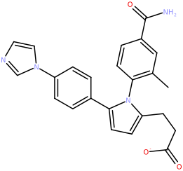

Introduction
============

Installing the CDPL Python Bindings
===================================

To be able to follow this tutorial the *CDPL Python* bindings need to be installed on your computer. The most straightforward way to accomplish this task is to install the latest official release deposited 
on `PyPI <https://pypi.org/project/CDPKit>`_ using the :program:`pip` command as follows:

.. code:: ipython3

    pip install cdpkit

Other ways to install the Python bindings are described `here <https://cdpkit.org/installation.html>`_.

Working with Molecules
======================

In-memory Representation of Molecules
-------------------------------------

The primary data structure for the in-memory representation of molecules (class `Chem.BasicMolecule <https://cdpkit.org/cdpl_api_doc/python_api_doc/classCDPL_1_1Chem_1_1BasicMolecule.html>`_) as well as all basic processing functionality is located in package
`CDPL.Chem <https://cdpkit.org/cdpl_api_doc/python_api_doc/namespaceCDPL_1_1Chem.html>`_. Importing the package as shown below will make all contained classes and functions accessible via the prefix *Chem.\**.

.. code:: ipython3

    import CDPL.Chem as Chem

An initally empty molecule object without any atoms and bonds can then be created as follows:

.. code:: ipython3

    mol = Chem.BasicMolecule()

The number of (explicit) atoms can be queried either by acessing the property `numAtoms <https://cdpkit.org/cdpl_api_doc/python_api_doc/classCDPL_1_1Chem_1_1AtomContainer.html>`_ or by calling the method `getNumAtoms() <https://cdpkit.org/cdpl_api_doc/python_api_doc/classCDPL_1_1Chem_1_1AtomContainer.html#aa18ef7240d27820c882998d8c8dbdfd7>`_:

.. code:: ipython3

    mol.numAtoms
    # or
    #mol.getNumAtoms()

.. parsed-literal::

    0

In the same manner, the number of bonds can be retrieved by:

.. code:: ipython3

    mol.numBonds
    # or
    #mol.getNumBonds()

.. parsed-literal::

    0

The *CDPL Python* bindings implement the `Rich Output <https://ipython.readthedocs.io/en/stable/interactive/plotting.html>`_ of
`Chem.MolecularGraph <https://cdpkit.org/cdpl_api_doc/python_api_doc/classCDPL_1_1Chem_1_1MolecularGraph.html>`_ instances in Jupyter notebooks. 
Rich output is activated by importing the `CDPL.Vis <https://cdpkit.org/cdpl_api_doc/python_api_doc/namespaceCDPL_1_1Vis.html>`_ package:

.. code:: ipython3

    import CDPL.Vis

After the import, simply typing the variable name and executing the cell will display the skeletal formula of the molecular graph.

Manual Construction of Molecular Structures
-------------------------------------------

Atoms are created by calling the method `addAtom() <https://cdpkit.org/cdpl_api_doc/python_api_doc/classCDPL_1_1Chem_1_1Molecule.html#ab998b55e7f56b00f47e3acbfa4511f2e>`_:

.. code:: ipython3

    a = mol.addAtom()

The method returns a `Chem.BasicAtom <https://cdpkit.org/cdpl_api_doc/python_api_doc/classCDPL_1_1Chem_1_1BasicAtom.html>`_ object which is owned by the creating *Chem.BasicMolecule* instance *mol*. The created atom does not yet possess any chemical properties like element, formal charge, and so on. The values of these properties need to be set explicitly by invoking dedicated property functions which take the atom and desired value of the property as arguments. For example

.. code:: ipython3

    Chem.setType(a, Chem.AtomType.C)

will set the type property of the atom to the atomic number of carbon. The value of the type property can be retrieved by the associated function

.. code:: ipython3

    Chem.getType(a)

.. parsed-literal::

    6

In a similar fashion, bonds are created by calling the method `addBond() <https://cdpkit.org/cdpl_api_doc/python_api_doc/classCDPL_1_1Chem_1_1Molecule.html#acd42f15d874185b4eea2cf497a509ea6>`_ 
which expects the indices (zero-based) of the two atoms to connect as arguments:

.. code:: ipython3

    Chem.setType(mol.addAtom(), Chem.AtomType.C) # add second carbon atom
    
    b = mol.addBond(0, 1)

The method returns a `Chem.BasicBond <https://cdpkit.org/cdpl_api_doc/python_api_doc/classCDPL_1_1Chem_1_1BasicBond.html>`_ object which is also owned by the creating *Chem.BasicMolecule* instance *mol*. As with atoms, the created bond does not yet have any properties. To set the bond order to a value of 2 (= double bond) the property function `Chem.setOrder() <https://cdpkit.org/cdpl_api_doc/python_api_doc/namespaceCDPL_1_1Chem.html#ab4460ac3bac716de49c744c52d980181>`_ needs to be called:

.. code:: ipython3

    Chem.setOrder(b, 2)

A previously set bond order property value can be accessed by the accompanying getter function `Chem.getOrder() <https://cdpkit.org/cdpl_api_doc/python_api_doc/namespaceCDPL_1_1Chem.html#a2a3103e8e0338219a5703da063cd3ef5>`_:

.. code:: ipython3

    Chem.getOrder(b)

.. parsed-literal::

    2

.. code:: ipython3

    mol

To create a more complex molecule, e.g. Pyridine, from the Ethene fragment that is currently described by **mol** the following lines will do the trick:

.. code:: ipython3

    # create missing atoms and set atom types
    Chem.setType(mol.addAtom(), Chem.AtomType.C)
    Chem.setType(mol.addAtom(), Chem.AtomType.C)
    Chem.setType(mol.addAtom(), Chem.AtomType.C)
    Chem.setType(mol.addAtom(), Chem.AtomType.N)
    
    # create missing bonds and set orders
    Chem.setOrder(mol.addBond(1, 2), 1)
    Chem.setOrder(mol.addBond(2, 3), 2)
    Chem.setOrder(mol.addBond(3, 4), 1)
    Chem.setOrder(mol.addBond(4, 5), 2)
    Chem.setOrder(mol.addBond(5, 0), 1)

.. code:: ipython3

    mol.numBonds

.. parsed-literal::

    6

.. code:: ipython3

    mol.numAtoms

.. parsed-literal::

    6

.. code:: ipython3

    mol

.. image:: cdpl_python_tutorial_files/cdpl_python_tutorial_32_0.svg

Reading Molecules from Input Data
---------------------------------

Data provided as Strings
^^^^^^^^^^^^^^^^^^^^^^^^

.. rubric:: SMILES and SMARTS

For the direct parsing of SMILES strings the `CDPL.Chem <https://cdpkit.org/cdpl_api_doc/python_api_doc/namespaceCDPL_1_1Chem.html>`_ package provides the built-in utility function 
`Chem.parseSMILES() <https://cdpkit.org/cdpl_api_doc/python_api_doc/namespaceCDPL_1_1Chem.html#a97463a5b3b08debaa2b2299a2644e912>`_. 
The function returns a `Chem.Molecule <https://cdpkit.org/cdpl_api_doc/python_api_doc/classCDPL_1_1Chem_1_1Molecule.html>`_ object representing the chemical structure 
encoded by the given SMILES string. For example:

.. code:: ipython3

    mol = Chem.parseSMILES('c1c(C(=O)O)ccc(CNN)c1')
    
    mol

.. image:: cdpl_python_tutorial_files/cdpl_python_tutorial_34_0.svg

A similar function called `Chem.parseSMARTS() <https://cdpkit.org/cdpl_api_doc/python_api_doc/namespaceCDPL_1_1Chem.html#a5248eaa483ae5dc078a8f276c91ed5dc>`_ can be used to parse and and prepare SMARTS patterns for substructure searching:

.. code:: ipython3

    mol = Chem.parseSMARTS('c1:c:[n,o,s]:c:c:1-[C:2](-,=[*])-,=O')
    
    mol

.. image:: cdpl_python_tutorial_files/cdpl_python_tutorial_36_0.svg

.. rubric:: Other formats

The general procedure for reading molecules from string data in one of the supported input formats (including SMILES and SMARTS) is as follows:

1. Create an instance of class `Base.StringIOStream <https://cdpkit.org/cdpl_api_doc/python_api_doc/classCDPL_1_1Base_1_1StringIOStream.html>`_ that wraps the string and serves as input data source for the next steps.
2. Create a suitable `Chem.MoleculeReaderBase <https://cdpkit.org/cdpl_api_doc/python_api_doc/classCDPL_1_1Chem_1_1MoleculeReaderBase>`_ subclass instance that will perform the format-specific decoding of the molecule data in step 3.
3. Call the `read() <https://cdpkit.org/cdpl_api_doc/python_api_doc/classCDPL_1_1Chem_1_1MoleculeReaderBase.html#a07056e4d2a6de5045d59f2356d3d5521>`_ method of the created data reader providing an instance of class `Chem.BasicMolecule <https://cdpkit.org/cdpl_api_doc/python_api_doc/classCDPL_1_1Chem_1_1BasicMolecule.html>`_ for the storage of the read molecular structure as argument. 

Molecule data readers for a specific format (Step 2) can be created in two ways:

1. Via class `Chem.MoleculeReader <https://cdpkit.org/cdpl_api_doc/python_api_doc/classCDPL_1_1Chem_1_1MoleculeReader.html>`_ providing the `Base.StringIOStream <https://cdpkit.org/cdpl_api_doc/python_api_doc/classCDPL_1_1Base_1_1StringIOStream.html>`_ instance (Step 1) and a data format specifier (= file extension or one of the data format descriptors defined in class `Chem.DataFormat <https://cdpkit.org/cdpl_api_doc/python_api_doc/classCDPL_1_1Chem_1_1DataFormat.html>`_) as constructor arguments.
2. Direct instantiation of a format-specific subclass of `Chem.MoleculeReaderBase <https://cdpkit.org/cdpl_api_doc/python_api_doc/classCDPL_1_1Chem_1_1MoleculeReaderBase>`_ (e.g. `Chem.MOL2MoleculeReader <https://cdpkit.org/cdpl_api_doc/python_api_doc/classCDPL_1_1Chem_1_1MOL2MoleculeReader.html>`_ implementing the Sybyl MOL2 format input).

Example: Reading a molecule from a string providing data in MDL SDF format

.. code:: ipython3

    import CDPL.Base as Base
    
    sdf_data = """5950
              12162506342D
    
     13 12  0     1  0  0  0  0  0999 V2000
        5.1350   -0.2500    0.0000 O   0  0  0  0  0  0  0  0  0  0  0  0
        4.2690    1.2500    0.0000 O   0  0  0  0  0  0  0  0  0  0  0  0
        2.5369    0.2500    0.0000 N   0  0  0  0  0  0  0  0  0  0  0  0
        3.4030   -0.2500    0.0000 C   0  0  1  0  0  0  0  0  0  0  0  0
        3.4030   -1.2500    0.0000 C   0  0  0  0  0  0  0  0  0  0  0  0
        4.2690    0.2500    0.0000 C   0  0  0  0  0  0  0  0  0  0  0  0
        3.4030    0.3700    0.0000 H   0  0  0  0  0  0  0  0  0  0  0  0
        2.7830   -1.2500    0.0000 H   0  0  0  0  0  0  0  0  0  0  0  0
        3.4030   -1.8700    0.0000 H   0  0  0  0  0  0  0  0  0  0  0  0
        4.0230   -1.2500    0.0000 H   0  0  0  0  0  0  0  0  0  0  0  0
        2.0000   -0.0600    0.0000 H   0  0  0  0  0  0  0  0  0  0  0  0
        2.5369    0.8700    0.0000 H   0  0  0  0  0  0  0  0  0  0  0  0
        5.6720    0.0600    0.0000 H   0  0  0  0  0  0  0  0  0  0  0  0
      1  6  1  0  0  0  0
      1 13  1  0  0  0  0
      2  6  2  0  0  0  0
      4  3  1  6  0  0  0
      3 11  1  0  0  0  0
      3 12  1  0  0  0  0
      4  5  1  0  0  0  0
      4  6  1  0  0  0  0
      4  7  1  0  0  0  0
      5  8  1  0  0  0  0
      5  9  1  0  0  0  0
      5 10  1  0  0  0  0
    M  END
    > <PUBCHEM_COMPOUND_CID>
    5950
    
    $$$$
    """
    
    ios = Base.StringIOStream(sdf_data)
    
    reader = Chem.MoleculeReader(ios, 'sdf')
    # or
    #reader = Chem.MoleculeReader(ios, Chem.DataFormat.SDF)
    # or
    #reader = Chem.SDFMoleculeReader(ios)
    
    reader.read(mol)
    mol

Reading Molecules from Files
^^^^^^^^^^^^^^^^^^^^^^^^^^^^

Reading molecules from files also requires the creation of a `Chem.MoleculeReaderBase <https://cdpkit.org/cdpl_api_doc/python_api_doc/classCDPL_1_1Chem_1_1MoleculeReaderBase>`_ subclass instance that performs the actual format-specific data decoding work. As with string data, several options exist:

1. Instantiation of class `Chem.MoleculeReader <https://cdpkit.org/cdpl_api_doc/python_api_doc/classCDPL_1_1Chem_1_1MoleculeReader.html>`_ passing the path to the file as constructor argument. When just a path is provided as argument then the data format will be determined automatically from the file extension. To override this behaviour, a second argument specifying the actual file extension string to use (e.g. sdf, smi, mol2, ..) or one one of the data format descriptors defined in class `Chem.DataFormat <https://cdpkit.org/cdpl_api_doc/python_api_doc/classCDPL_1_1Chem_1_1DataFormat.html>`_ has to be provided.
2. Instantiation of class `Chem.MoleculeReader <https://cdpkit.org/cdpl_api_doc/python_api_doc/classCDPL_1_1Chem_1_1MoleculeReader.html>`_ passing an instance of class `Base.FileIOStream <https://cdpkit.org/cdpl_api_doc/python_api_doc/classCDPL_1_1Base_1_1FileIOStream.html>`_ that was created for the file as the first and and a format specifier as the second argument. The format specification can be a characteristic file extension or one of the data format descriptors defined in class `Chem.DataFormat <https://cdpkit.org/cdpl_api_doc/python_api_doc/classCDPL_1_1Chem_1_1DataFormat.html>`_.
3. Direct instantiation of a format-specific subclass of `Chem.MoleculeReaderBase <https://cdpkit.org/cdpl_api_doc/python_api_doc/classCDPL_1_1Chem_1_1MoleculeReaderBase>`_ (e.g. `Chem.MOL2MoleculeReader <https://cdpkit.org/cdpl_api_doc/python_api_doc/classCDPL_1_1Chem_1_1MOL2MoleculeReader.html>`_ implementing the Sybyl MOL2 format input) that accepts an instance of class `Base.FileIOStream <https://cdpkit.org/cdpl_api_doc/python_api_doc/classCDPL_1_1Base_1_1FileIOStream.html>`_ as constructor argument.
4. Direct instantiation of a format-specific subclass of `Chem.MoleculeReaderBase <https://cdpkit.org/cdpl_api_doc/python_api_doc/classCDPL_1_1Chem_1_1MoleculeReaderBase>`_ (e.g. `Chem.FileSDFMoleculeReader <https://cdpkit.org/cdpl_api_doc/python_api_doc/classCDPL_1_1Chem_1_1FileSDFMoleculeReader.html>`_ implementing MDL SDF format input) that accepts a file path as argument to the constructor.

.. code:: ipython3
        
    # - Option 1 -
    reader = Chem.MoleculeReader('/path/to/input/file.sdf')
    # or
    reader = Chem.MoleculeReader('/path/to/input/file', 'smi')
    # or
    reader = Chem.MoleculeReader('/path/to/input/file', Chem.DataFormat.SMILES)

    # - Option 2 -
    reader = Chem.MoleculeReader(Base.FileIOStream('/path/to/input/file'), 'sdf')
    # or
    reader = Chem.MoleculeReader(Base.FileIOStream('/path/to/input/file'), Chem.DataFormat.SDF)

    # - Option 3 -
    reader = Chem.MOL2MoleculeReader(Base.FileIOStream('/path/to/input/file'))

    # - Option 4 -
    reader = Chem.FileSDFMoleculeReader('/path/to/input/file')

Sequential Molecule Reading
^^^^^^^^^^^^^^^^^^^^^^^^^^^

Given a properly initialized `Chem.MoleculeReaderBase <https://cdpkit.org/cdpl_api_doc/python_api_doc/classCDPL_1_1Chem_1_1MoleculeReaderBase>`_ subclass instance, molecules can be read in the order provided by the input data by repeatedly calling the `read() <https://cdpkit.org/cdpl_api_doc/python_api_doc/classCDPL_1_1Chem_1_1MoleculeReaderBase.html#a07056e4d2a6de5045d59f2356d3d5521>`_ method. If there are no more molecules to read, the return value of the method will evaluate to ``False``:

.. code:: ipython3

    smi_data = """c1n(ccn1)c1ccc(cc1)c1ccc(n1c1c(cc(cc1)C(=O)N)C)CCC(=O)[O-] 022_3QJ5_A
    CNC(=O)[C@H](C(C)(C)C)NC(=O)[C@@H]([C@H](C)N([O-])C=O)CCCc1ccccc1 023_2WO9_B
    N1N(C(c2c(C=1Nc1cc([nH]n1)C)ccc(N1CC[NH+](CC1)C)c2)=O)C(C)C 027_3PIX_A
    """
    
    ios = Base.StringIOStream(smi_data)
    reader = Chem.MoleculeReader(ios, 'smi')
    mol_count = 0
    
    while reader.read(mol):
       mol_count += 1
    
    print(f'Read {mol_count} molecules')

.. parsed-literal::

    Read 3 molecules

Random Access to Input Molecules
^^^^^^^^^^^^^^^^^^^^^^^^^^^^^^^^

There is a special version of the `read() <https://cdpkit.org/cdpl_api_doc/python_api_doc/classCDPL_1_1Chem_1_1MoleculeReaderBase.html#a07056e4d2a6de5045d59f2356d3d5521>`_ method of class `Chem.MoleculeReaderBase <https://cdpkit.org/cdpl_api_doc/python_api_doc/classCDPL_1_1Chem_1_1MoleculeReaderBase>`_ which expects the index (zero-based) of the molecule to read as its first argument. This way molecules can be read in any order, no matter what their order is in the input data. The number of available molecules can be queried either by calling the method `getNumRecords() <https://cdpkit.org/master/cdpl_api_doc/python_api_doc/classCDPL_1_1Chem_1_1MoleculeReaderBase.html#aedf59cb63964cb6d497d251acddd4c80>`_ or by accessing the property `numRecords <https://cdpkit.org/master/cdpl_api_doc/python_api_doc/classCDPL_1_1Chem_1_1MoleculeReaderBase.html>`_.

Example:

.. code:: ipython3

    ios = Base.StringIOStream(smi_data)
    reader = Chem.MoleculeReader(ios, 'smi')
    
    num_mols = reader.getNumRecords()
    # or
    #num_mols = reader.numRecords
    
    print(f'Number of input molecules: {num_mols}')

.. parsed-literal::

    Number of input molecules: 3

.. code:: ipython3

    # read the 2nd molecule
    reader.read(1, mol)
    
    mol

.. image:: cdpl_python_tutorial_files/cdpl_python_tutorial_45_0.svg

.. code:: ipython3

    # read the 1st molecule
    reader.read(0, mol)
    
    mol

If the index is out of the valid range then a corresponding exception will be thrown:

.. code:: ipython3

    # there is no 5th molecule
    reader.read(4, mol)

::

    ---------------------------------------------------------------------------

    IndexError                                Traceback (most recent call last)

    <ipython-input-40-a898d182f25f> in <module>
          1 # there is no 5th molecule
    ----> 2 reader.read(4, mol)
    

    IndexError: StreamDataReader: record index out of bounds

